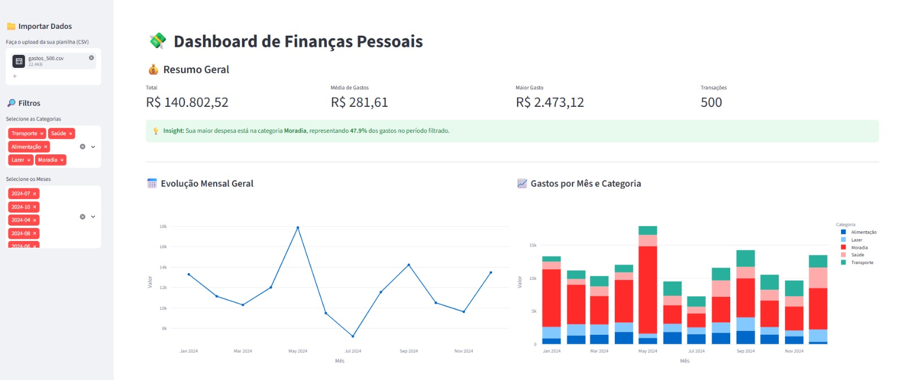
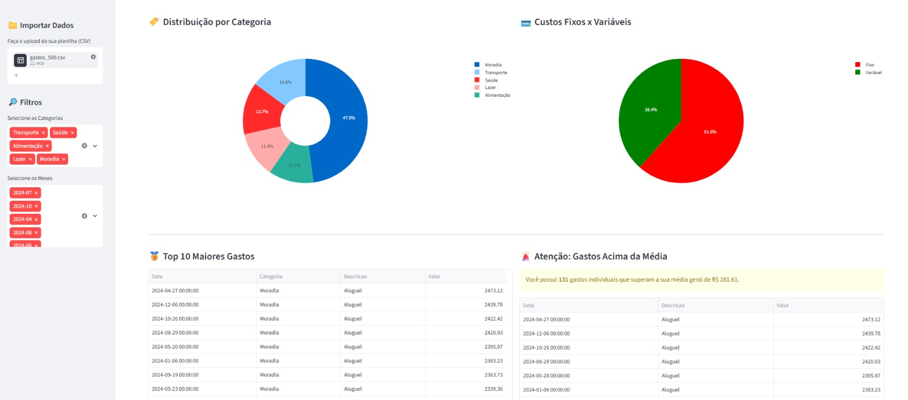

# Dashboard de Finanças Pessoais

Projeto desenvolvido durante meus estudos em Python e Análise de Dados para explorar gastos pessoais em um dashboard interativo.

A aplicação permite carregar um arquivo CSV, filtrar os dados por mês e categoria e visualizar indicadores e gráficos. A execução é local, iniciada pelo terminal.

## Funcionalidades

- Upload de arquivos CSV e filtros por mês e categoria.
- Indicadores de total, média, maior gasto e quantidade de transações.
- Evolução e comparação mensal dos gastos.
- Distribuição dos valores por categoria e por tipo: fixo ou variável.
- Ranking dos 10 maiores gastos e identificação de valores acima da média.
- Resumo da categoria com maior gasto e tabela dos dados filtrados.

## Tecnologias

- **Python:** desenvolvimento da aplicação.
- **Pandas:** tratamento e análise dos dados.
- **Plotly:** gráficos interativos.
- **Streamlit:** interface do dashboard.

## Dados de teste

O projeto inclui uma base fictícia com 500 registros e um script para gerar esses dados, desenvolvido com apoio de IA.

O arquivo contém as colunas `Data`, `Categoria`, `Tipo`, `Descricao` e `Valor`, com gastos de alimentação, transporte, lazer, moradia e saúde.

## Imagens do dashboard





## Estrutura do projeto

```text
Dashboard-de-Finan-as-Pessoais/
├── app.py
├── gerar_dados.py
├── gastos_500.csv
├── requirements.txt
└── README.md
```

## Como executar

Com o Python instalado, abra o terminal na pasta do projeto e instale as dependências:

```bash
python -m pip install -r requirements.txt
```

Para gerar uma nova base de teste, execute:

```bash
python gerar_dados.py
```

Esse passo é opcional caso você já tenha o arquivo `gastos_500.csv`.

Inicie o dashboard:

```bash
python -m streamlit run app.py
```

O dashboard será aberto no navegador, rodando localmente. Se ele não abrir automaticamente, acesse o endereço local exibido no terminal.

Na aplicação, carregue o arquivo `gastos_500.csv` para explorar os dados.

## Aprendizados

Neste projeto, pratiquei tratamento de dados com Pandas, organização de datas, agrupamentos, cálculo de indicadores e criação de gráficos e filtros interativos.

Desenvolvido por **Isabella Passos**.